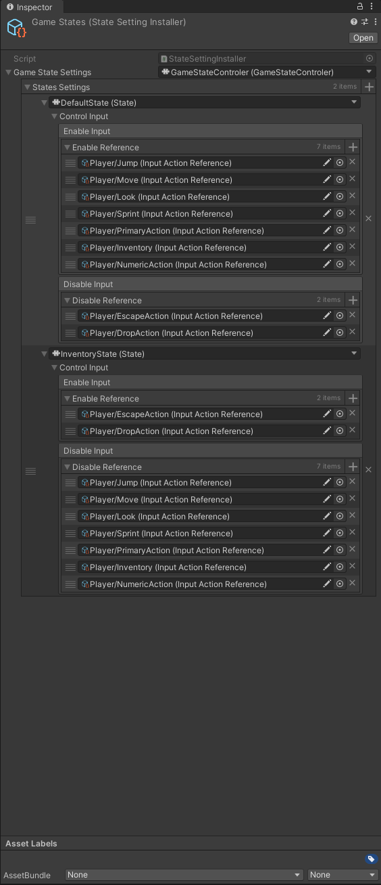
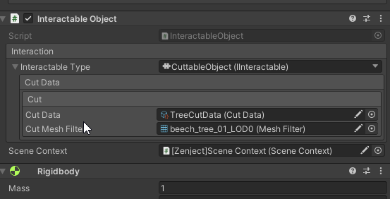
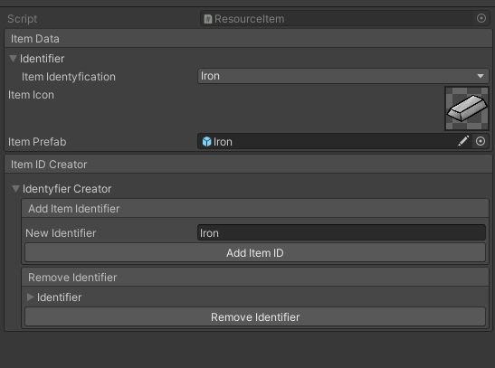
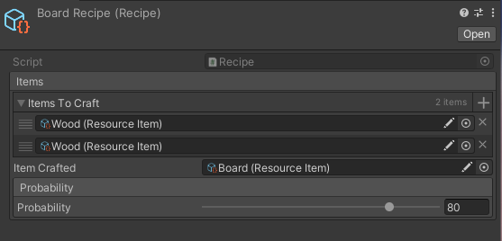
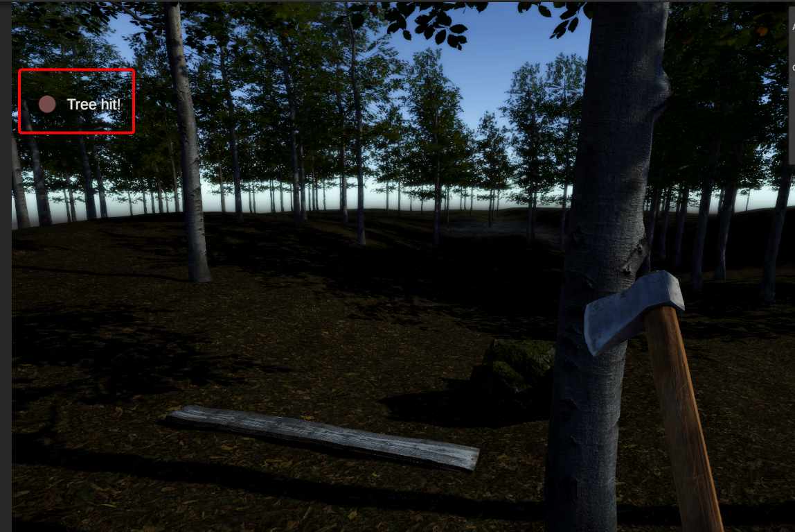

# Example-Project

## About
Example Project to prosta gra o zbieraniu zasobów i craftowaniu przedmiotów. Gracz może zbierać zasoby za pomocą siekiery oraz kilofa. Można swobonie ścinać drzewa w grze, które opadają po ścięciu w sposób generyczny.

### Input
1. WASD - poruszanie postacią
2. TAB - Otwarcie ekwipunku
3. ESC - Zamknięcie Ekwipunku
4. R - Usuwanie przedmiotu z ekwipunku, tylo kiedy kursor znajduje sie nad ikoną przedmiotu
5. LPM - Akcja czyli użycie przedmiotu lub/gdy postać ma wole rece podnosi przedmiot
6. Klawisze Numeryczne
 * 1 - Siekiera
 * 2 - Kilof
 * 3 - chowanie przedmiotu

### Klasa State
Klasa State jest klasą abstrakcyjną, która definiuje podstawowy interfejs dla różnych stanów gry. Jest to część wzorca stanowego, który umożliwia zarządzanie różnymi trybami gry (takimi jak tryb inwentarza, tryb domyślny itp.).

#### Pola:

_controlInput: Obiekt typu InputControl, który jest serializowany do Unity i kontroluje wejścia użytkownika w danym stanie.

#### Metody:
1. ExecuteState(): Metoda wywołująca funkcję Execute na obiekcie _controlInput. Może być nadpisana przez klasy dziedziczące w celu dodania specyficznego zachowania dla każdego stanu.
2. ResetState(): Abstrakcyjna metoda odpowiedzialna za resetowanie stanu.
3. BindState(DiContainer container): Abstrakcyjna metoda służąca do bindowania stanu z kontenerem Zenject.
4. AssignValue(object value): Abstrakcyjna metoda używana do przypisywania wartości do stanu, np. inicjalizowania menadżera inventory.

> [!NOTE]
> Wszystkie klasy używają frameworka Zenject do wstrzykiwania zależności i zarządzania inicjalizacją. BindState, AssignValue oraz klasy pomocnicze jak ControleInjection używają Zenject do integracji stanu gry i innych komponentów.

 #### Baza danych stanów
<p align="center">
  
</p>

W każdym stanie można edytować Input. Wyłącznie oraz włączanie. Aby uniknąć wywoływanie niechcianych funkcji.

### Zbieranie Przedmiotów i Zasobów

Gracz zbiera zasoby przez interakje z otoczeniem. Każde drzewo może być ścięte i jest oparte na generycznym cięciu mesha. Używając myszki można kontolować wysokość ścinania obiektu.

```csharp

        private void CutObject()
        {
            Cutter cutter = new Cutter(_cutMeshFilter, _cutData, _cutMeshFilter.transform.parent, _contact);

            cutter.Slice();

            MoveSlicedObject(cutter.UpperHull);

            _inventory.AddMulipleItem(_cutData.ItemValue, _cutData.ItemToAdd);

            UnityEngine.Object.Destroy(_cutMeshFilter.transform.parent.gameObject);
        }

```

Wszystkie elementy interakcji są dodawane poprzez interfejs IInteractable. Component InteractableObject służy do przetrzymywania rodzaju interakcji:

```csharp
public class InteractableObject : MonoBehaviour
    {
        #region Fields

        [BoxGroup("Interaction")]
        [SerializeReference] private IInteractable _interactableType;

        [SerializeField] private SceneContext _sceneContext;

        #endregion

        #region Properties
        public IInteractable interactableType { get => _interactableType; }
        #endregion
        }

```
Każdy obiekty wpięty w system interakcji zawiera ten sam komoponent składający się:
* IInteractable - czyli sposoby interakcji. Obecnie 2 typy Cuttable i Mining
* Data - czyli globalne ustawienia obiektu. Ilość uderzeń, jaki przedmiot ma dostarczyć.
* Scene Context - do implementacji DI

<p align="center">
  
</p>

### Przedmioty
Informacje o przedmiocie jest przetrzymywane w ScriptableObject, który tworzymy tak samo jak jak obiekty w projekcie.
Elementy jak musimy dopasować to:
1. Indentyfikator przedmiotu
2. Prefab przedmiotu
3. Ikona

#### Identyfikatory
Wyszukiwanie przedmiotów jest oparte o indywidualne identyfikatory które znajdują w `Item SO`.
Nowe identyfikatory możemy tworzyć z poziomu edytora w inspectorze dołączonego do każdego SO typu `Item`

<p align="center">
  
</p>

### Crafitng
Crafting został oparty na ScriptableObject każdy przedmiot może zostać utworzony generycznie i no-code. 
System sprawdza czy dodane przedmioty do slotów mogą zostać wytworzone. Dodatkowo istnieje możliwość skalowania system czyli:
* Dodwania większej ilości slotów na przedmioty
* Dodwanie róznych przedmiotów do recept

> [!NOTE]
> W prefabie Crafting_Panel jest możliwości dodania Failure Callback w postaci UnityEvent. Można bez problemowo dodać wywołanie dowolnej metody bez codowania

<p align="center">
  
</p>

#### UI Ekwipunku

Ekwipunek składa się z dwóch części 
1. Inventory
2. Crafting

Przedmioty w Inventory korzystają z IDrop IDrag. Przeciągamy przedmioty do slotów i klikamy przecisk "Craft". Posiada on animacje opartą o DOTween. Po czasie otrzymujemy informacje czy craftowanie jest udane.

> [!IMPORTANT]
> Aby zmienić prawdopodobieństwo uzyskania przedmiotu należy ja ustawić w SO recepty!
> Baza danych znajduje się w folderze `Assets/DataBase/[DataBase]Recipes/`
> Jest to wartość %

<p align="center">
  
</p>


### Notyfikacje
Kolejnym elementem są notyfikacje pojawiające się prawym górnym ekranie informującym o stanie gracza. Są zdarzenia takiej jak:
* Podniesienie przedmiotu z ziemi
* Wydobycie przedmiotu
* Powodzenie/Niepowodzenie craftingu
* Detekcja

Wywołanie notyfikacji zostało przypisane do Eventu statyczne na potrzeby wywołania w każdym momencie. 


```csharp
    private void Hit(Collision collisionInfo)
        {
            if (HitByCutObject(collisionInfo))
            {
                bool inv = _inventory != null;
                
                if (_cutDisable) return;

                _cutDisable = true;

                _currentHits++;

                StaticEvents.ExecuteShowMessage("Tree hit!");

                if (_currentHits >= _cutData.MaxHits)
                {
                    ContactPoint point = collisionInfo.GetContact(0);

                    _contact = point.point;

                    CutObject();

                    return;
                }

                new DOTimer(_cutData.HitDelay, EnableCut);
            }

```


<p align="center">
  
</p>


